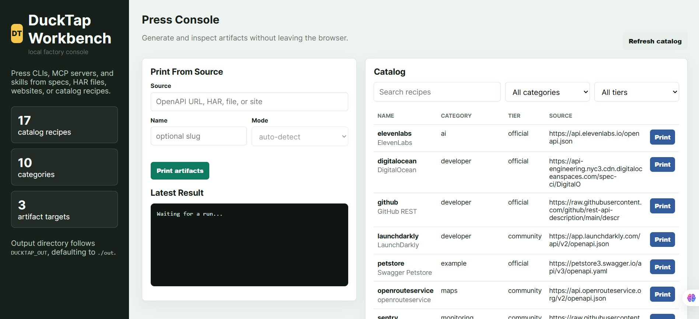

# DuckTap

> **Tape any API to your agent in one command.**
> DuckTap is a CLI factory for AI agents. Point it at an OpenAPI spec, a HAR
> file, or a plain website, and it *prints* a Python CLI, an MCP server, and a
> Claude/Cursor/Codex skill -- wired up, cached, scored, ready to ship.

**Website:** [ducktap-website.vercel.app](https://ducktap-website.vercel.app)

[](https://github.com/zanni098/DuckTap/actions/workflows/ci.yml)
[](https://github.com/zanni098/DuckTap/releases)
[](https://pypi.org/project/ducktap/)
[](LICENSE)
[](pyproject.toml)

DuckTap is inspired by [Printing Press](https://printingpress.dev) by
[@mvanhorn](https://github.com/mvanhorn) -- same north star (*muscle memory for
agents*) -- rebuilt in Python with multi-LLM support, a web dashboard,
Playwright-powered browser sniffing, and a real plugin system.



```text
$ ducktap press tests/fixtures/petstore.yaml --out ./out --name petstore
Pressed petstore (19 operations) -> out
  python-cli: 10 files
  mcp-server: 5 files
  skill:      3 files

Scorecard: 92/100 (A)
  - coverage:      95  -- 19 operations exposed
  - documentation: 100 -- 19/19 operations have docs
  - auth:          100 -- 2 auth scheme(s)
  - typed_params:  54  -- 29/53 params typed/enum
  - artifacts:     100 -- 3/3 expected artifact dirs present
  - naming:        100 -- 19/19 unique operation ids
```

## Why a CLI factory?

In a world of AI agents, **a well-designed CLI is muscle memory**. No hunting
through docs, no wrong turns, no wasted tokens. DuckTap reads the spec, sniffs
the traffic when no spec exists, and prints:

- **A Python CLI** (`<api>-dt-cli`) -- Click-based, auth from env vars, JSON by default, pretty mode for humans, local SQLite mirror for compound queries, retries on transient errors.
- **An MCP server** (`<api>-dt-mcp`) -- every operation exposed as an MCP tool, stdio transport, drop into Claude Desktop or Cursor in 60 seconds.
- **A skill** for Claude Code, Cursor (`.mdc`), and a generic `tools.json` -- so any agent harness can pick up where the others left off.
- **A scorecard** grading coverage, docs, auth clarity, typed params, artifacts, and naming.

## Install

```bash
pip install ducktap
ducktap --version
```

For browser sniffing (optional):

```bash
pip install "ducktap[sniff]"
playwright install chromium
```

**Requires Python 3.11+.**

<details>
<summary>Developer install (contributing to DuckTap itself)</summary>

```bash
git clone https://github.com/zanni098/DuckTap
cd DuckTap
pip install -e ".[dev]"
python -m pytest tests/ -q   # 66 passed
```

</details>

## Quick start

```bash
# 1. Press a built-in catalog entry (no URL needed)
ducktap catalog list                  # browse 17 built-in APIs
ducktap catalog print stripe          # press Stripe CLI + MCP + skill

# 2. From any OpenAPI spec URL
ducktap press https://petstore3.swagger.io/api/v3/openapi.yaml

# 3. From a local spec or HAR file
ducktap press ./openapi.yaml --name myapi
ducktap press ./traffic.har  --name myapi

# 4. From a website with no public spec (needs [sniff] extra)
ducktap sniff https://example.com

# 5. Open the dashboard
ducktap ui    # http://127.0.0.1:8765
```

Running `ducktap press` prints something like:

```
Pressed petstore (19 operations) -> ./out
  python-cli: 10 files
  mcp-server:  5 files
  skill:       3 files

Scorecard: 92/100 (A)
  - coverage:      95  -- 19 operations exposed
  - documentation: 100 -- 19/19 operations have docs
  - auth:          100 -- 2 auth scheme(s)
  - typed_params:   54 -- 29/53 params typed/enum
  - artifacts:     100 -- 3/3 expected artifact dirs present
  - naming:        100 -- 19/19 unique operation ids
```

What you get under `./out/`:

```
out/
├── petstore-dt-cli/        # pip install -e .  →  petstore-dt-cli --help
│   ├── pyproject.toml
│   ├── README.md
│   ├── petstore_dt_cli/
│   │   ├── main.py
│   │   ├── commands.py     # one click subcommand per API operation
│   │   ├── client.py       # httpx + env-var auth + retries
│   │   └── mirror.py       # local SQLite cache
│   └── tests/test_smoke.py
├── petstore-dt-mcp/        # pip install -e .  →  add to Claude Desktop config
│   └── petstore_dt_mcp/server.py
└── skills/ducktap-petstore/
    ├── SKILL.md            # Claude Code skill
    ├── ducktap-petstore.mdc  # Cursor rule
    └── tools.json          # generic agent tool definitions
```

## How DuckTap improves on Printing Press

| | Printing Press | **DuckTap** |
|---|---|---|
| Language | Go | Python -- easier to extend, richer LLM ecosystem |
| LLM | Claude only | **Multi-LLM via LiteLLM** (Anthropic, OpenAI, Gemini, Ollama, Groq, Azure) |
| Skills | Claude Code | **Claude Code + Cursor `.mdc` + generic `tools.json`** |
| UI | None | **Local FastAPI dashboard** (`ducktap ui`) |
| Plugins | Source fork | **Entry-point plugin system** -- drop-in discoverers & generators |
| Browser sniff | Custom Go browser | **Playwright** -- full HAR export, scriptable actions |
| Generated CLI runtime | Single Go binary | Python (pip-installable, hackable, single-file editable) |

See [`docs/COMPARISON.md`](docs/COMPARISON.md) for the full feature matrix.

## Commands

```text
ducktap press <source>          # discover + generate (the default loop)
ducktap research <source>       # discover only -- emit normalized APISpec JSON
ducktap sniff <url>             # browser-sniff a site (needs [sniff] extra)
ducktap scorecard <source>      # quality scorecard
ducktap shipcheck <name>        # structural & runtime sanity checks
ducktap catalog list|print      # browse the recipe library
ducktap plugins list            # show installed discoverers + generators
ducktap ui                      # local web dashboard
```

## Plugins

Add a discoverer or generator without forking. Register via Python entry points:

```toml
# your_plugin/pyproject.toml
[project.entry-points."ducktap.plugins"]
mything = "your_plugin.module"   # module just calls plugins.register_discoverer(...)
```

See [`docs/PLUGINS.md`](docs/PLUGINS.md) and the sample at
`src/ducktap/plugins/builtin/graphql_intro.py`.

## Architecture

```
input (URL | spec | HAR)
        │
        ▼
  ┌─────────────┐
  │  Discovery  │   openapi / har / browser-sniff / graphql (plugin) / ...
  └──────┬──────┘
         ▼
   APISpec (Pydantic) ──── intermediate normalized representation
         │
         ▼
  ┌─────────────┐
  │  Generator  │   python-cli / mcp-server / skill / ...
  └──────┬──────┘
         ▼
  artifacts/       (CLI pkg + MCP pkg + SKILL.md + cursor.mdc + tools.json)
         │
         ▼
  ┌─────────────┐
  │   Verify    │   scorecard + shipcheck + (optional) live smoke test
  └─────────────┘
```

See [`docs/ARCHITECTURE.md`](docs/ARCHITECTURE.md).

## Roadmap

See [`docs/ROADMAP.md`](docs/ROADMAP.md). Highlights for v0.3+:

- **GraphQL** first-class discoverer (introspection + persisted queries)
- **Crowd-sniff** research via web search + LiteLLM
- Smart **action recording** for browser sniff (record clicks/forms, replay headless)
- **mitmproxy-backed sniff** as a headless-Chromium alternative
- Rate-limit + retry-with-backoff aware request inference
- **Compound query** macros (canonical "what's interesting about X" recipes)
- **CLI publish** to PyPI + GitHub in one command

## License

MIT -- see [`LICENSE`](LICENSE).

## Acknowledgements

Inspired by [Printing Press](https://github.com/mvanhorn/cli-printing-press) by
Matt Van Horn and the agent-CLI playbook proved out by
[discrawl](https://github.com/steipete/discrawl) and
[gogcli](https://github.com/steipete/gogcli).
