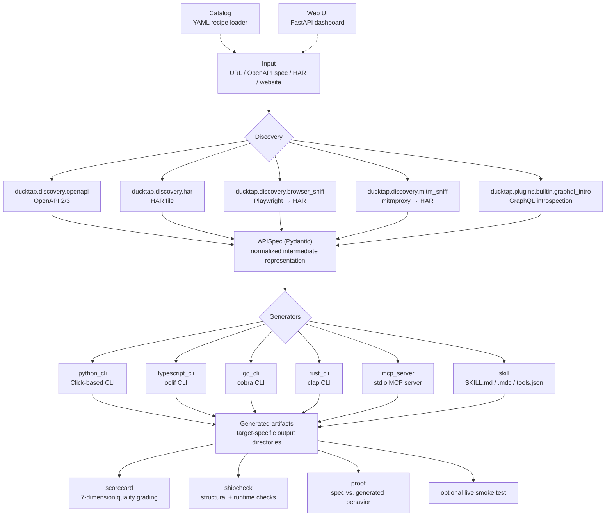

# DuckTap Architecture

DuckTap is organized around one normalized data model (`APISpec`) sitting
between two extensible plugin layers (Discoverers and Generators).

## Modules

| Module | Responsibility |
|---|---|
| `ducktap.core.spec` | `APISpec` (pydantic) — the intermediate representation. |
| `ducktap.core.naming` | Slugify, snake/kebab case, flag/env-var conventions. |
| `ducktap.core.plugins` | Plugin registry + entry-point loader. |
| `ducktap.core.pipeline` | High-level `discover()` and `press()`. |
| `ducktap.discovery.openapi` | OpenAPI 2/3 → `APISpec`. |
| `ducktap.discovery.har` | HAR file → `APISpec` (clustered request grouping). |
| `ducktap.discovery.browser_sniff` | Playwright → HAR → `APISpec`. |
| `ducktap.generator.python_cli` | `APISpec` → Click-based Python CLI package. |
| `ducktap.generator.typescript_cli` | `APISpec` → oclif TypeScript CLI (`tsc`-verified). |
| `ducktap.generator.go_cli` | `APISpec` → cobra Go CLI (`go build`-verified). |
| `ducktap.generator.rust_cli` | `APISpec` → clap Rust CLI (`cargo build`-verified). |
| `ducktap.generator.mcp_server` | `APISpec` → MCP server package (stdio). |
| `ducktap.generator.skill` | `APISpec` → `SKILL.md`, `.mdc`, `tools.json`. |
| `ducktap.discovery.mitm_sniff` | mitmproxy → HAR → `APISpec` (no headless browser). |
| `ducktap.plugins.builtin.graphql_intro` | GraphQL introspection → `APISpec`. |
| `ducktap.llm.base` | LiteLLM wrapper — multi-provider chat (the `[llm]` extra). |
| `ducktap.verify.scorecard` | Quality grading (7 dimensions). |
| `ducktap.verify.proof` | Proof of behavior — spec vs. generated source. |
| `ducktap.manifest` | `.ducktap.json` provenance manifest. |
| `ducktap.verify.shipcheck` | Structural + runtime sanity checks. |
| `ducktap.catalog.registry` | YAML recipe loader. |
| `ducktap.webui.app` | FastAPI dashboard. |
| `ducktap.cli` | Top-level `ducktap` Typer entry point. |

## Architecture Diagram

The following diagram shows DuckTap's end-to-end discovery, normalization, generation, and verification pipeline.



## The pipeline


## The pipeline

```
press(source, out_dir)
  │
  ├── discover(source)
  │     for d in [openapi, graphql, har, browser-sniff, …]:
  │       if d.can_handle(source): return d.discover(source).normalize()
  │
  ├── archetype detection + Non-Obvious Insight   (deterministic unless use_llm)
  │
  ├── for tgt in targets:
  │     generators[tgt].generate(spec, out_dir)
  │
  ├── write .ducktap.json provenance manifest
  │
  └── PressResult(spec, out_dir, artifacts, manifest)
```

`normalize()` is the contract between discovery and generation: it guarantees
the invariants every generator relies on (a slug name, unique operation ids).
Put shared invariants there rather than in each generator.

## Why this shape

- **One intermediate format** means new discoverers and new generators evolve independently.
- **Plugins via entry points** means improvements ship as PyPI packages, not forks.
- **Pydantic models** give us free JSON serialization (research command writes the spec to disk for inspection / debugging / LLM polish steps).
- **Click for generated CLIs** because every Python user already has it and Click subcommands have richer help output than argparse out of the box.
- **MCP SDK** rather than hand-rolled JSON-RPC, so we get protocol-version updates for free.
